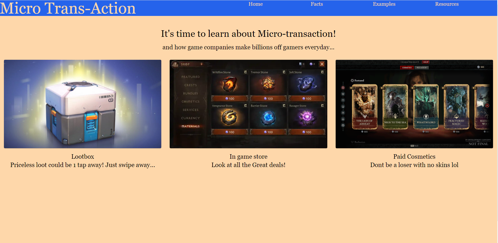

# Macro-Trans-action

## Description 📝
This website is built to inform gamers of the danger that is microtransactions. Users are presented with images of common microtransactions actions. This website demonstrates data and statistics about microtransactions in games today.. There is a simulator that illustrates an example of how much money users spend on games to get a five-star item. Some resources are provided to help people avoid microtransactions.

## Tech/framework used 
- HTML/CSS
- JavaScript
- JQuery
- Tailwind

## Credits
- [Van Tam Chau](https://github.com/vantam8300)
- [Laolagi, Shawn](https://github.com/LigerBomb)
- [Huang, Kuan-yu](https://github.com/Jaq41000)
- [Braxton, Mathew](https://github.com/Mattie-B)

## Website

https://vantam8300.github.io/Macro-Trans-action/